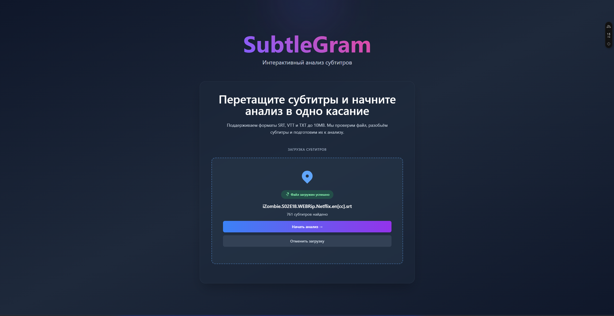
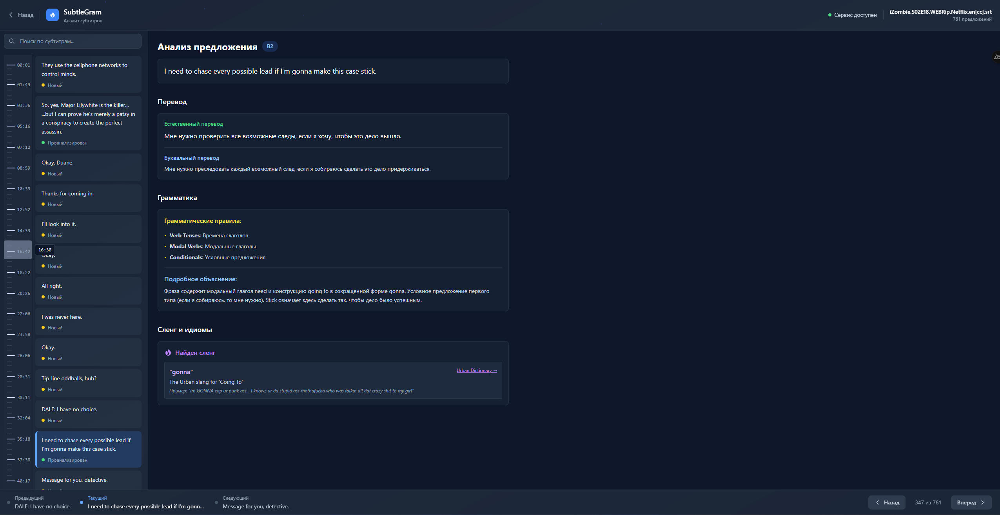
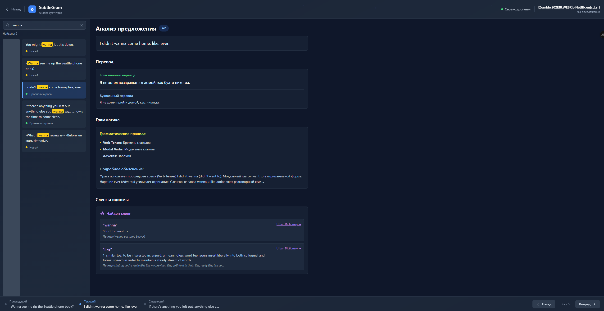

# SubtleGram

AI анализатор субтитров для изучения английского языка. Загружайте субтитры фильмов/сериалов, кликайте на фразы и получайте комплексный лингвистический анализ с помощью AI моделей.

## Демо

**Посмотреть в демо-режиме:** [https://predt64.github.io/subtleGram/](https://predt64.github.io/subtleGram/)

*Чтобы получить примерное представление о проекте, посмотрите его демо-версию с тестовыми данными*


## Стек технологий

### Frontend

- **Nuxt 4** - Vue.js фреймворк с SSR/SSG
- **Vue 3** - Прогрессивный JavaScript фреймворк
- **TypeScript** - Типизированный JavaScript
- **Tailwind CSS** - Utility-first CSS фреймворк
- **Pinia** - Современное управление состоянием для Vue
- **VueUse** - Утилиты для Vue (sessionStorage)
- **Sentence Splitter** - Разделение текста на предложения

### Backend

- **Node.js** - JavaScript runtime
- **Express.js** - REST API сервер
- **TypeScript** - Типизированный JavaScript
- **OpenRouter API** - Множество AI моделей (Mistral, GPT, Qwen, etc.)
- **Urban Dictionary API** - Определения сленга
- **Multer** - Загрузка файлов
- **Express Rate Limit** - Защита от перегрузки
- **Helmet** - Безопасность HTTP заголовков

### Архитектура

- **Feature-Sliced Design (FSD)** - Архитектурная методология
- **Composition API** - Современные Vue 3 composables для переиспользования логики
- **Монолитный frontend** - Vue.js приложение
- **Pinia stores** - Централизованное управление состоянием
- **Session Storage** - Сохранение данных через VueUse
- **TypeScript** - Полная типизация для надежности

## Структура проекта

```
subtleGram/
├── front/                          # Nuxt.js приложение (FSD архитектура)
│   ├── entities/
│   │   └── subtitle/               # Сущность субтитров
│   │       ├── lib/                # Логика обработки субтитров
│   │       └── stores/             # Pinia store субтитров
│   ├── features/
│   │   └── file-upload/            # Функция загрузки файлов
│   │       ├── lib/                # Бизнес-логика загрузки
│   │       └── stores/             # Store состояния загрузки
│   ├── shared/
│   │   ├── api/                    # API клиенты
│   │   ├── lib/                    # Утилиты (таймлайн, форматирование, clamp)
│   │   └── types/                  # TypeScript типы
│   ├── widgets/                    # UI компоненты
│   │   ├── analysis-panel/         # Панель анализа текста
│   │   ├── subtitle-timeline/      # Таймлайн субтитров
│   │   │   ├── composables/        # Переиспользуемая логика компонента
│   │   └── workspace-*/            # Компоненты страницы с анализом
│   ├── pages/                      # Страницы приложения
│   │   ├── index.vue               # Главная страница
│   │   └── workspace.vue           # Страница с анализом
│   └── nuxt.config.ts              # Конфигурация Nuxt
└── back/                           # Express.js API сервер
    ├── controllers/                 # Обработчики HTTP запросов
    │   ├── analyzeController.ts     # Анализ текста
    │   └── uploadController.ts      # Загрузка файлов
    ├── routes/
    │   └── subtitles.ts             # API маршруты субтитров
    ├── services/                    # Бизнес-логика
    ├── types/                       # TypeScript типы
    ├── utils/                       # Утилиты
    └── API-README.md                # Подробная документация API
```

## Установка и запуск

### Frontend

```bash
cd front
npm install
npm run dev
```

Приложение будет доступно на http://localhost:3000

### Backend

```bash
cd back
# Создайте .env файл с API ключом
# Добавьте OPENROUTER_API_KEY=ваш_ключ_здесь

npm install
npm run dev
```

API сервер будет доступен на http://localhost:3001

**Получение API ключа:**
- Перейдите на [OpenRouter.ai](https://openrouter.ai/keys)
- Зарегистрируйтесь и получите бесплатный API ключ
- Добавьте ключ в переменную `OPENROUTER_API_KEY`

**Важно:** Без API ключа анализ предложений не будет работать. Загрузка и отображение субтитров работают без ключа.

### Сборка для продакшена

```bash
# Frontend
cd front
npm run build

# Backend
cd back
npm run build
npm start
```

## Ключевые возможности

-  **Загрузка субтитров** - поддержка SRT/VTT/TXT форматов
-  **Интерактивный анализ** - клик на любое предложение для AI анализа
-  **Грамматический разбор** - объяснение грамматики и правил
-  **Переводы** - естественные и дословные варианты
-  **Сленг** - определения из Urban Dictionary
-  **Session Storage** - сохранение данных через VueUse
-  **Поиск и фильтрация** - быстрый поиск по субтитрам
-  **Таймлайн** - визуальные метки на полосе прокрутки

## Скриншоты

Перевод от ИИ на скринах не самый лучший, но тут всё зависит от качества модели. Я использовал бесплатные, поэтому и результат соответствующий)

### Загрузка субтитров

*Главная страница с drag & drop загрузкой субтитров*

### Анализ предложения

*AI анализ выбранного предложения с грамматикой и переводами*

### Поиск по субтитрам

*Поиск с подсветкой результатов и навигация по таймлайну*
